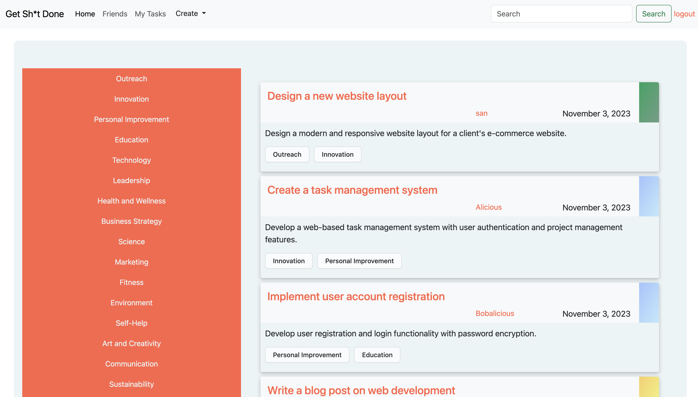

# Social-Task-App

Heroku Link: https://peaceful-beach-14774-2857744df451.herokuapp.com/

Repo Link: https://github.com/MrDietCola/Social-Task-App

## Description
This is a social app that allows you to login to your profile and then create a task and share it with others. The app also allows you to give a status to the task and add tags to help better filter the tasks. 

## Installation

N/A

## Usage

Organize Tasks with Personalized Tags: Create and manage your tasks efficiently by assigning personalized tag labels. Categorize your tasks based on priority, deadlines, or custom criteria that suit your workflow. Stay organized and in control of your responsibilities with our flexible and user-friendly task organization system.

Share Tasks: Collaborate with your friends, colleagues, or team members by sharing tasks effortlessly.

Discover Tasks: Quickly find the tasks you need by utilizing our powerful search feature, which enables you to search for tasks based on specific tag labels. Spend less time searching and more time accomplishing your goals with our efficient and intuitive task discovery mechanism.

Streamline Productivity: Our intuitive and easy-to-navigate interface is designed to enhance your productivity and simplify your task management experience.

Maximize Efficiency: Unlock the full potential of your productivity with our comprehensive set of task management tools. Our feature-rich platform equips you with the necessary tools to manage your tasks effectively and efficiently.

## License

MIT